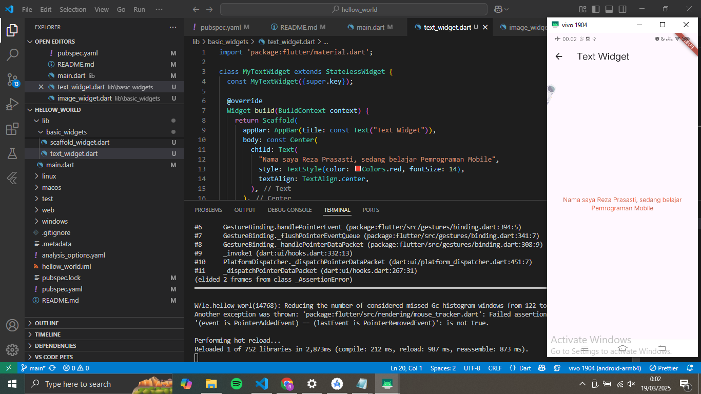

## hello_world
Nama : Reza Prasasti
NIM  : 230444040006
PD   : Manajemen Informatika (04421)
Ini adalah tugas aplikasi pertama dan widget dasar flutter.

A new flutter project.

Laporan 1 : Text Widgets.

Laporan 2 : Image Widgets.

Laporan 3 : Loading Cupertino.

Laporan 4 : Floating Action Button.

Laporan 5 : Scaffold Widget.

Laporan 6 : Dialog Widget.

Laporan 7 : Text Field.

Laporan 8 : Date and Time Pickers.
